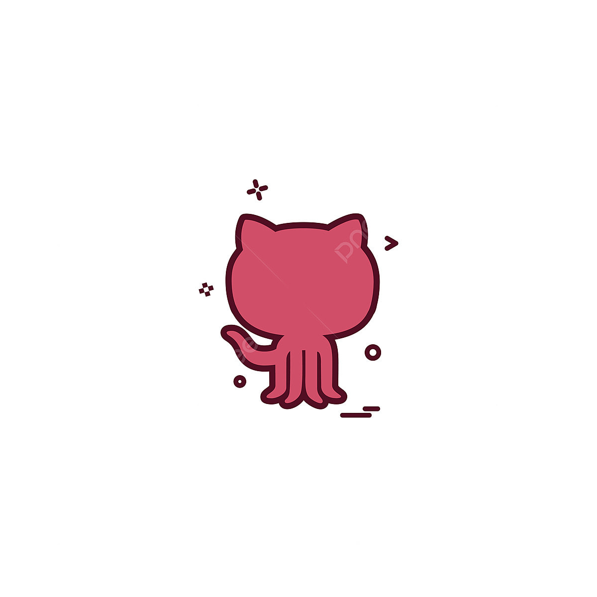

# Welcome to my Github, I'm Maria! 
> Studying Higher Degree in Web Application Development 
 


### </br>A little more about me...  

```javascript
const maca = {
  pronouns: "she" | "her",
  code: [Javascript, Java, HTML, CSS, Python],
  frameworks: [Phaser]
  ide: [NeatBeans, VisualStudioCode, Oracle],
  bbdd: [PL-SQL]  
  challenge: "I am doing the #retosdeprogramacion challenge focused on python"
  practicing: ["Games with Phaser", "Styles with CSS" , "Backend with Python"]
}

```

🫶 <b>Learning a bit more every day about this incredible community</b>


